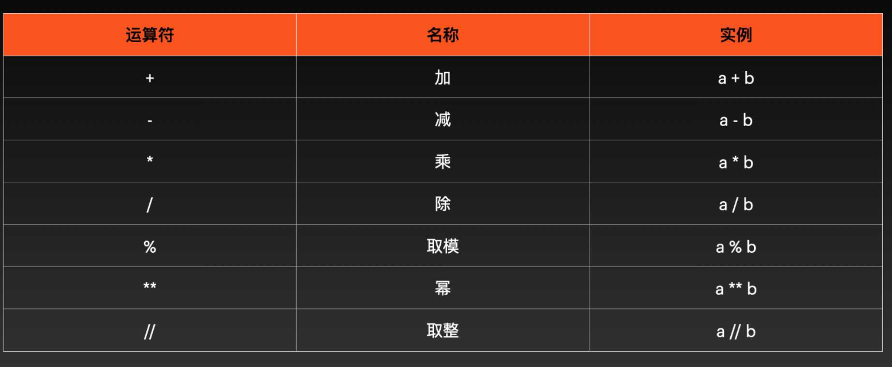
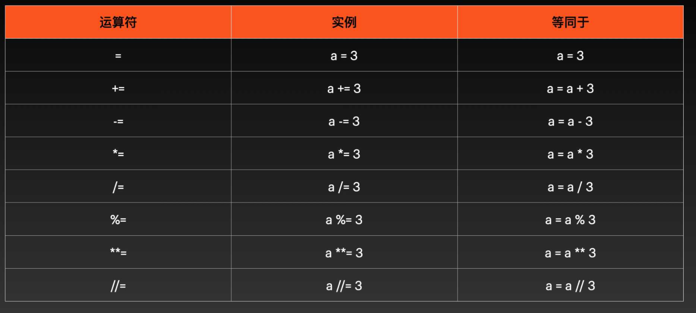
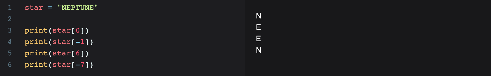
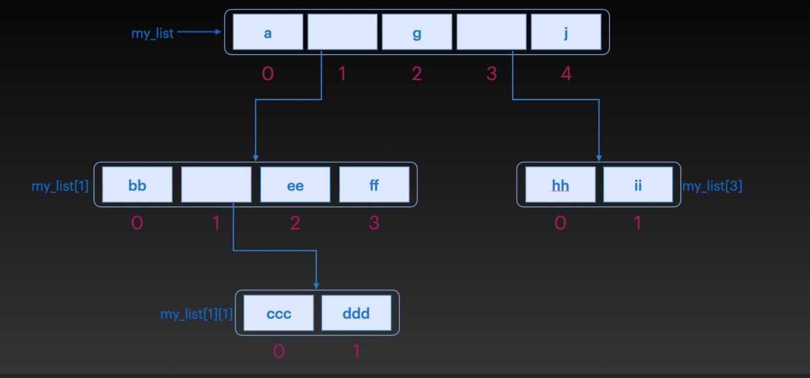
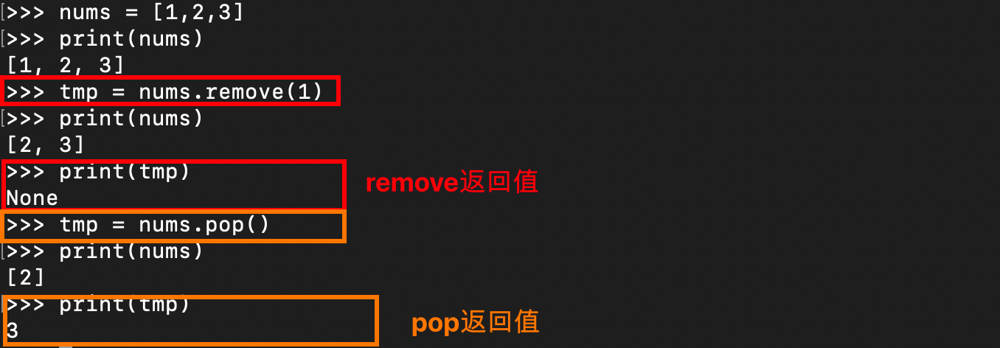

# 一：Python简介

- 吉多·范罗苏姆（Guido van Rossum）在 1989 年的圣诞节期间，为了打发时间而编写的一个编程语言。
- 解释型语言
- 应用领域：数据分析、自动化、网络爬虫、Web开发、游戏开发、人工智能机器学习

- 使用空格缩进划分代码块

- print函数用法：`print("盘古，你好！")`

- 单引号、双引号、三引号的作用是一致的

  ```python
  print(50+50) # 100
  print('50+50') # 50+50
  ```

- 常用的转义字符：

  ```python
  \n 换行符
  \a 响铃
  \b 退格
  \t 制表符
  \r 回车
  ```

- Python中的关键字：

  

# 二：Python变量

==Python没有声明变量的命令，首次为其赋值时，才会创建变量==

```python
name = 'hello'
age = 18
print(name)
print(age)
```

注意：同一个变量名称，对其进行多次赋值的时候，变量会取最后一次的赋值内容

**多变量的赋值**

```python
x = y = z = '泥人'
print(x)
print(y)
print(z)

name, age, weight = '女娲', 18, 49
print(name)
print(age)
print(weight)
```

# 三：Python数据类型

Python 中并没有声明变量的命令，变量的创建是在为其赋值时完成的，==这样变量的类型便由值的类型决定==

注意：python中没有++、--这样的自增运算符

### 3.1 数字类型

- int、float

  

**运算符**

- 算术运算符

  

- 赋值运算符

  

- 比较运算符：==、!=、>、<、>=、<=

  比较运算符返回的结果是True/False

  

- 逻辑运算符：

  

### 3.2 布尔类型

在 Python 中，用 `True`、`False` 表示布尔值。布尔值可以用 `and`、`or` 和 `not` 运算。

```python
print(True and True)
print(True and False)
print(False and False)
```

### 3.3 字符串类型

Python中，以单引号 `'` 或双引号 `"` 括起来的任意文本就是字符串

```python
say_hi = "hello world"
print(say_hi)
```

如果字符串横跨多行，可以使用三个单引号或三个双引号将字符串括起来。

```python
print('''Beautiful is better than ugly.
Explicit is better than implicit.
Simple is better than complex.
Complex is better than complicated.
Flat is better than nested.
Sparse is better than dense.''')
```

#### 3.3.1 索引

==变量[下标]==：字符串中的字符可以通过索引来提取。可以从前往后索引，也可以从后往前索引。

- 从前往后索引：下标从0开始

- 从后往前索引：下标从-1开始

  

  

#### 3.3.2 切片

==变量[头下标:尾下标]==：索引用来提取单个字符，切片用来可以提取多个字符（<font color='red'>**不包括尾下标对应的元素**</font>）头尾下标也可以使用负值

特殊用法：

- star[:]：当不指定头下标和尾下标时，获取的是整个字符串
- star[0:]：当只指定头下标时，获取的是从头下标到字符串结尾的所有字符
- star[:3]：当只指定尾下标时，获取的是字符串的开头到尾下标的字符串（不包括尾下标对应的元素）


#### 3.3.3 字符串长度

len(变量名)：`print(len(name))`

```python
name = "wang"
print(len(name))  # 4
```

#### 3.3.4 字符串方法

变量.strip()：返回删除掉开头和结尾空白字符的新字符串

```python
star = " NEPTUNE "

print(star)  # NEPTUNE 
print(len(star))  #9

# 删除开头和结尾的空白字符
print(star.strip()) #NEPTUNE 
print(len(star.strip()))  #7
```

变量.upper()：返回大写的字符串

```python
star = "neptune"
print(star.upper())  # NEPTUNE
```

变量.lower()：返回小写的字符串

```python
star = "NEPTUNE"
print(star.lower()) # neptune
```

变量.replace()：返回被另一段字符替换掉的新字符串

```python
say_hi = "Hello World!"

print(say_hi.replace("World", "Kitty"))  # Hello Kitty!

print(say_hi)  # 原串仍旧是Hello World!
```

变量.split()：按指定的分隔符分隔字符串

```python
say_hi = "Mercury,Venus,Earth,Mars,Jupiter,Saturn,Uranus,Neptune,Pluto"
print(say_hi.split(","))  

# 结果：['Mercury', 'Venus', 'Earth', 'Mars', 'Jupiter', 'Saturn', 'Uranus', 'Neptune', 'Pluto']
```

in、not in：检查字符串中是否存在特定短语或字符

```python
book_name = "Men Are from Mars, Women Are from Venus"
is_exist = "Mars" in book_name
print(is_exist)  #True

book_name = "Men Are from Mars, Women Are from Venus"
is_exist = "Mars" not in book_name
print(is_exist)  #False
```

+：对字符串进行拼接

```python
first_part = "Men Are from Mars"
second_part = "Women Are from Venus"
print(first_part + ', ' + second_part)  # Men Are from Mars, Women Are from Venus
```

#### 3.3.5 字符串中引用变量

- 在字符串前面加小写字母 `'f'`
- 字符串中，将需要引用的变量，用花括号包起来 `{name}`

```python
name = 'Earth'
age = 4.543E9

print(f"My name is {name}, {age} years old")
# My name is Earth, 4543000000.0 years old
```

#### 3.3.6 字符串中转义

字符串用单引号括起来的，内部可以正常输出双引号

```python
print('The man who has made up his mind to win will never say "impossible".')
```

字符串用双引号扩起来的，内部可以正常输出单引号

```python
print("You're uinique, nothing can replace you.")
```

单引号扩起来的内部想使用单引号  或者  双引号扩起来的内部想使用双引号，得使用\转义

```python
print('You\'re uinique, nothing can replace you.')
print("The man who has made up his mind to win will never say \"impossible\"")
```

### 3.4 获取数据类型and类型转换

type(变量名)：可以获取变量的数据类型


类型转换：int()，float()，str()

```python
weight1 = 50
weight2 = float(weight1)
weight3 = str(weight1)

print(type(weight1))
print(type(weight2))
print(type(weight3))

print(weight3)  # 50
```

# 四：if流程控制

```python
if 条件:
    ...
else:
	...
    
    
if 条件1:
    ...
elif 条件2:
    ...
elif 条件3:
    ...
else:
    ...
```

# 五：列表List

### 5.1 列表概念

列表是有序数据的集合，定义的语法是使用方括号[]扩起来以逗号分隔的数据，如：

```python
eight_immortal = ['汉钟离', '张果老', '韩湘子', '铁拐李', '吕洞宾', '何仙姑', '蓝采和', '曹国舅']
print(eight_immortal)
```

Python中，列表有如下特性：

- 有序：如果两个列表包含的元素相同，但是元素的排列顺序不同，那么他们是两个不同的列表。
- 同一个列表可以包含不同类型的数据
- 元素可重复
- 可以使用索引、切片访问

### 5.2 使用步长访问列表

步长使用方法：==列表名[m:n:步长]== 步长在实际的编程中，是用数据表示的，1 表示 1 步，2 表示 2 步，步长也可以省略，省略时步长默认为 1。

```python
eight_immortal = ['汉钟离', '张果老', '韩湘子', '铁拐李', '吕洞宾', '何仙姑', '蓝采和', '曹国舅']
print(eight_immortal[0:7:2])  # ['汉钟离', '韩湘子', '吕洞宾', '蓝采和']

# 步长为1，表示从前向后访问，步长为 -1，即表示反向访问，起点为曹国舅，反向访问1步，访问到蓝采和，继续反向访问1步，为何仙姑
```

==将步长设置为 -1，可以实现列表的翻转==：步长为1，表示从前向后访问，步长为 -1，即表示反向访问，起点为曹国舅，反向访问1步，访问到蓝采和，继续反向访问1步，为何仙姑

```python
eight_immortal = ['汉钟离', '张果老', '韩湘子', '铁拐李', '吕洞宾', '何仙姑', '蓝采和', '曹国舅']
print(eight_immortal[::-1])  # ['曹国舅', '蓝采和', '何仙姑', '吕洞宾', '铁拐李', '韩湘子', '张果老', '汉钟离']
```

### 5.3 列表嵌套

==列表可以嵌套==：列表中的元素同样可以是一个列表，嵌套的列表共占元素的一个位置，具体位置信息如下图

```python
my_list = ['a', ['bb', ['ccc', 'ddd'], 'ee', 'ff'], 'g', ['hh', 'ii'], 'j']
print(my_list) # my_list长度为5
```



对于只嵌套一个的列表，访问其中某个元素时，索引的使用方法是`列表名[嵌套列表的位置][所需访问的元素在嵌套列表的位置]`，比如，我们想访问hh，方法就是`my_list[3][0]`，3 是嵌套列表在 `my_list` 中的位置，0 是 hh 在嵌套列表中的位置

```python
my_list = ['a', ['bb', ['ccc', 'ddd'], 'ee', 'ff'], 'g', ['hh', 'ii'], 'j']

# a
print(my_list[0])  

# ['bb', ['ccc', 'ddd'], 'ee', 'ff']
print(my_list[1])  

# bb
print(my_list[1][0])

# ccc
print(my_list[1][1][0])
```

### 5.4 修改列表元素

一次改变一个值（通过索引）：

```python
eight_immortal = ['汉钟离', '张果老', '韩湘子', '铁拐李', '吕洞宾', '何仙姑', '蓝采和', '曹国舅']

eight_immortal[0] = '逍遥闲散'
eight_immortal[5] = '清婉动人'
```

一次改变多个值（通过切片）：

```python
eight_immortal = ['汉钟离', '张果老', '韩湘子', '铁拐李', '吕洞宾', '何仙姑', '蓝采和', '曹国舅']

eight_immortal[0:3] = ['逍遥闲散', '倒骑毛驴','巧夺造化']

print(eight_immortal)
```

### 5.5 删除元素  del  remove  pop

删除元素：==del 列表名[index]==

```python
eight_immortal = ['汉钟离', '张果老', '韩湘子', '铁拐李', '吕洞宾', '何仙姑', '蓝采和', '曹国舅']

del eight_immortal[1]
print(eight_immortal)
```

删除多个元素：==del 列表名[start:end]==

```python
eight_immortal = ['汉钟离', '张果老', '韩湘子', '铁拐李', '吕洞宾', '何仙姑', '蓝采和', '曹国舅']

del eight_immortal[0:3]
print(eight_immortal)
```

删除指定元素值的元素：==列表名.remove(元素值)==，注意：如果指定的元素在列表中不存在，则会报错。

```python
eight_immortal = ['汉钟离', '张果老', '韩湘子', '铁拐李', '吕洞宾', '何仙姑', '蓝采和', '曹国舅']

eight_immortal.remove('汉钟离')
```

删除指定index的元素：==列表名.pop(index)==，如果不指定index，默认删除最后一个元素

```python
eight_immortal = ['汉钟离', '张果老']

eight_immortal.pop(1)  #等价于：eight_immortal.pop()
print(eight_immortal)  #['汉钟离']
```

**remove与pop的区别：**

- remove传入的参数为元素值，pop传入的参数为索引值

- remove返回值为None，pop的返回值为删除的元素

  

### 5.6 增加元素  +  append  insert

==列表名 += [元素1,元素2,元素3,...,元素n]==   使用`+`往列表中添加元素，添加的元素会自动的被添加到列表尾部

```python
eight_immortal = ['汉钟离', '张果老', '韩湘子', '铁拐李', '吕洞宾', '何仙姑', '蓝采和', '曹国舅']
print(eight_immortal)

eight_immortal += ['容成公', '李耳', '董仲舒','张道陵','严君平','李八百','范长生','尔朱先生']
print(eight_immortal)
```

==列表名.append(元素)==  `append()` 也可以为列表添加元素，和`+`一样，也是在列表的结尾处添加元素，可以添加一个元素或列表

```python
eight_immortal = ['汉钟离', '张果老', '韩湘子', '铁拐李']
print(eight_immortal)

eight_immortal.append('吕洞宾')
print(eight_immortal)  #['汉钟离', '张果老', '韩湘子', '铁拐李', '吕洞宾']

eight_immortal.append(['何仙姑', '蓝采和', '曹国舅'])
print(eight_immortal)  #['汉钟离', '张果老', '韩湘子', '铁拐李', '吕洞宾', ['何仙姑', '蓝采和', '曹国舅']]
```

`+`和`append()`都是在列表的结尾处添加元素，那如果是想在列表的开始处添加元素或者是在列表中的任意位置添加元素需要如何实现呢？答：insert

==列表名.insert(index, 元素值)==  将元素值插入index位置（相当于在原来index位置之前插入一个元素）

```python
eight_immortal = ['汉钟离', '张果老', '韩湘子', '铁拐李']

eight_immortal.insert(3, '吕洞宾')
print(eight_immortal)  # ['汉钟离', '张果老', '韩湘子', '吕洞宾', '铁拐李']
```

# 六：循环

### 6.1 for循环

`for` 循环用于迭代序列（即列表、元组、字典、集合或字符串等）。这与其他编程语言中的 `for` 关键字不太相似，而是<font color='red'>**更像其他面向对象编程语言中的迭代器方法：for var in 集合**</font>

```python
numbers = [1, 2, 3, 4, 5, 6, 7, 8, 9, 10, 11, 12, 13, 14, 15, 16, 17, 18, 19, 20]

for var in numbers:
    print(var)
```

### 6.2 while循环

while循坏同其他语言while类似，while 条件:

```python
i = 0
while i < 20:
    i += 1
    print(i)
```

break与continue与其他语言相同：

- break：跳出整个循坏
- continue：跳过本轮

```python
# 对 20 以内的偶数求和
count = 0
i = 0
while i < 20:
    i += 1
    if i % 2 != 0:
        continue
    count += i

print("count = ", count)
```

# 七：字典

