# 一：Python简介

- 吉多·范罗苏姆（Guido van Rossum）在 1989 年的圣诞节期间，为了打发时间而编写的一个编程语言。

- 解释型语言、交互式语言、面向对象（不支持函数重载，支持运算符的重载）

- 应用领域：从简单的文字处理到web再到游戏，支持广泛的应用领域开发：数据分析、自动化、网络爬虫、Web开发、游戏开发、人工智能机器学习

- 使用缩进来表示代码块，不需要使用大括号 **{}**

- 编码：默认情况下，Python 3 源码文件以 **UTF-8** 编码，所有字符串都是 unicode 字符串。 当然你也可以为源码文件指定不同的编码：`# -*- coding: cp-1252 -*-`

- 单引号、双引号、三引号的作用是一致的

  ```python
  #!/usr/bin/python3
  
  print("Hello, World!")
  print(50+50) # 100
  print('50+50') # 50+50
  ```

- 常用的转义字符：

  ```python
  \n 换行符
  \a 响铃
  \b 退格
  \t 制表符
  \r 回车
  ```

- Python中的关键字：

  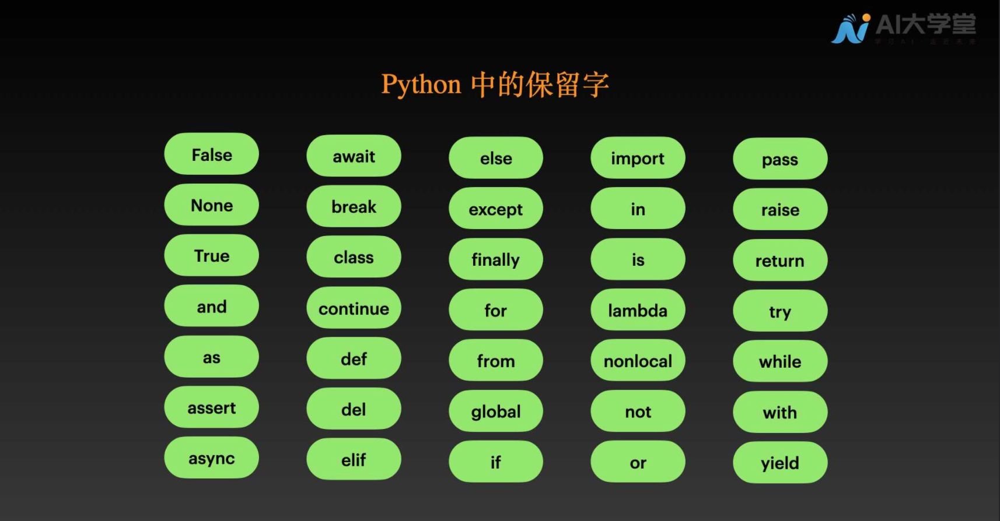

**Python注释**

```python
# 单行注释

'''
多行注释
'''

"""
多行注释
"""
```

**多行语句**

Python 通常是一行写完一条语句，但如果语句很长，我们可以使用反斜杠 \ 来实现多行语句，例如：

```python
total = item_one + \
        item_two + \
        item_three
```

在 [], {}, 或 () 中的多行语句，不需要使用反斜杠 \

**分号**

Python 可以在同一行中使用多条语句，语句之间使用分号 **;** 分割，以下是一个简单的实例：(类似shell中用法)

```python
import sys; x = 'runoob'; sys.stdout.write(x + '\n')
```

**print函数**

print函数用法：`print("盘古，你好！")`

**print** 默认输出是换行的，如果要实现不换行需要在变量末尾加上 **end=""**

```python
print("hello")
print( x, end=" " )
```

**指定解释器**

在Linux/Unix系统中，可以在脚本顶部添加以下命令让Python脚本可以像SHELL脚本一样可直接执行

```python
#! /usr/bin/env python3
```

然后给脚本添加可执行权限就可执行脚本了

```shell
chmod +x hello.py
./hello.py
```

也可以不在脚本内部指定，而是在执行的时候指定，这样即使没有chmod也能运行成功：

```python
python3 hello.py
```

<font color='green'>**模拟main函数**</font>：python是脚本语言，按命令一条一条执行，并没有像编译性语言有main函数作为程序入口。但是可以自定义一个main函数，使用`if __name__ == "__main__"`来模拟程序的入口：当前`__name__`变量的值为`__main__`时，即当前模块是主模块（也就是调用其他模块的模块），那么此模块名字就是`__main__`，就会调用定义的main函数

```python
def main():
    li = [10, 3, 2, 7, 20, -10]
    print("快速排序前：", li)
    quick_sort(li, 0, len(li)-1)
    print("快速排序后：", li)


if __name__ == "__main__":
    main()
```

# 二：Python变量

==Python没有声明变量的命令，首次为其赋值时，才会创建变量==

Python是弱数据类型的语言，变量就是变量，它没有类型，我们所说的"类型"是变量所指的内存中对象的类型。

```python
name = 'hello'
age = 18
print(name)
print(age)
```

注意：同一个变量名称，对其进行多次赋值的时候，变量会取最后一次的赋值内容

**多变量的赋值**

```python
x = y = z = '泥人'
print(x)
print(y)
print(z)

name, age, weight = '女娲', 18, 49
print(name)
print(age)
print(weight)
```

# 三：Python数据类型

Python 中并没有声明变量的命令，变量的创建是在为其赋值时完成的，==这样变量的类型便由值的类型决定==

注意：python中没有++、--这样的自增运算符

### 3.1 数字类型

- int、float

  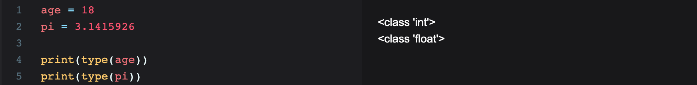

**运算符**

- 算术运算符

  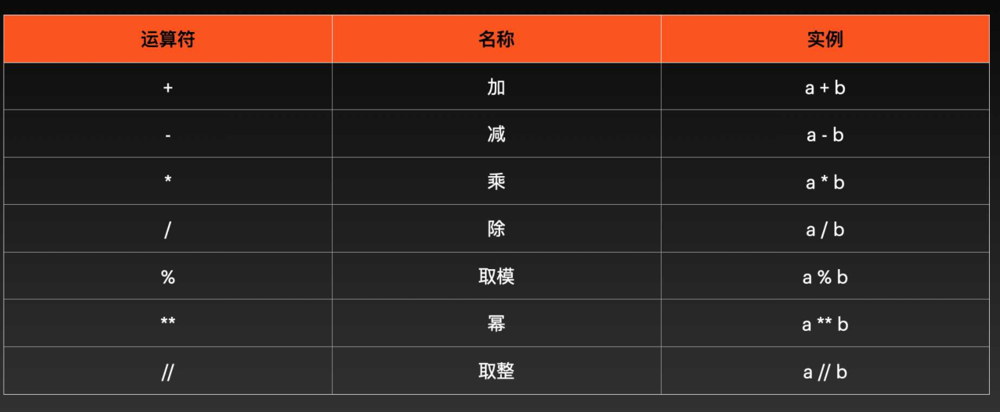

- 赋值运算符

  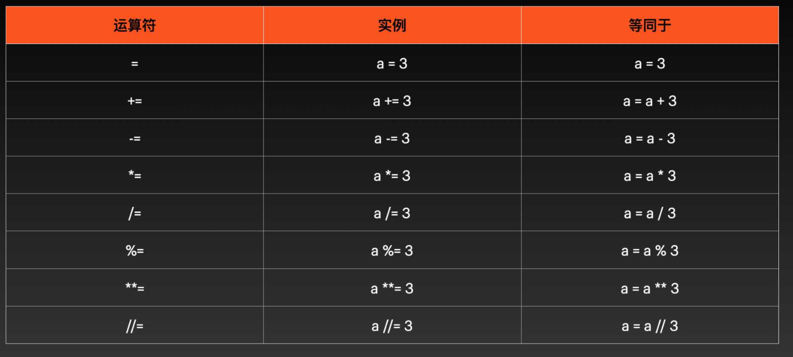

- 比较运算符：==、!=、>、<、>=、<=

  比较运算符返回的结果是True/False

  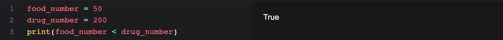

- 逻辑运算符：

  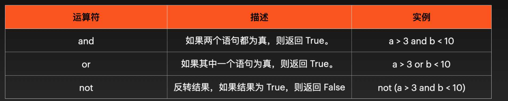

### 3.2 布尔类型

在 Python 中，用 `True`、`False` 表示布尔值。布尔值可以用 `and`、`or` 和 `not` 运算。

```python
print(True and True)
print(True and False)
print(False and False)
```

### 3.3 字符串类型

Python中，以单引号 `'` 或双引号 `"` 括起来的任意文本就是字符串

==Python 没有单独的字符类型，一个字符就是长度为 1 的字符串==

```python
say_hi = "hello world"
print(say_hi)
```

如果字符串横跨多行，可以使用三个单引号或三个双引号将字符串括起来。

```python
print('''Beautiful is better than ugly.
Explicit is better than implicit.
Simple is better than complex.
Complex is better than complicated.
Flat is better than nested.
Sparse is better than dense.''')
```

#### 3.3.1 索引

==变量[下标]==：字符串中的字符可以通过索引来提取。可以从前往后索引，也可以从后往前索引。

- 从前往后索引：下标从0开始

- 从后往前索引：下标从-1开始

  

  

#### 3.3.2 切片

==变量[头下标:尾下标]==：索引用来提取单个字符，切片用来可以提取多个字符（<font color='red'>**不包括尾下标对应的元素**</font>）头尾下标也可以使用负值

特殊用法：

- star[:]：当不指定头下标和尾下标时，获取的是整个字符串
- star[0:]：当只指定头下标时，获取的是从头下标到字符串结尾的所有字符
- star[:3]：当只指定尾下标时，获取的是字符串的开头到尾下标的字符串（不包括尾下标对应的元素）


#### 3.3.3 字符串长度

len(变量名)：`print(len(name))`

```python
name = "wang"
print(len(name))  # 4
```

#### 3.3.4 字符串方法

变量.strip()：返回删除掉开头和结尾空白字符的新字符串

```python
star = " NEPTUNE "

print(star)  # NEPTUNE 
print(len(star))  #9

# 删除开头和结尾的空白字符
print(star.strip()) #NEPTUNE 
print(len(star.strip()))  #7
```

变量.upper()：返回大写的字符串

```python
star = "neptune"
print(star.upper())  # NEPTUNE
```

变量.lower()：返回小写的字符串

```python
star = "NEPTUNE"
print(star.lower()) # neptune
```

变量.replace()：返回被另一段字符替换掉的新字符串

```python
say_hi = "Hello World!"

print(say_hi.replace("World", "Kitty"))  # Hello Kitty!

print(say_hi)  # 原串仍旧是Hello World!
```

变量.split()：按指定的分隔符分隔字符串

```python
say_hi = "Mercury,Venus,Earth,Mars,Jupiter,Saturn,Uranus,Neptune,Pluto"
print(say_hi.split(","))  

# 结果：['Mercury', 'Venus', 'Earth', 'Mars', 'Jupiter', 'Saturn', 'Uranus', 'Neptune', 'Pluto']
```

in、not in：检查字符串中是否存在特定短语或字符

```python
book_name = "Men Are from Mars, Women Are from Venus"
is_exist = "Mars" in book_name
print(is_exist)  #True

book_name = "Men Are from Mars, Women Are from Venus"
is_exist = "Mars" not in book_name
print(is_exist)  #False
```

+：对字符串进行拼接

```python
first_part = "Men Are from Mars"
second_part = "Women Are from Venus"
print(first_part + ', ' + second_part)  # Men Are from Mars, Women Are from Venus
```

#### 3.3.5 字符串中引用变量

- 在字符串前面加小写字母 `'f'`
- 字符串中，将需要引用的变量，用花括号包起来 `{name}`

```python
name = 'Earth'
age = 4.543E9

print(f"My name is {name}, {age} years old")
# My name is Earth, 4543000000.0 years old
```

#### 3.3.6 字符串中转义

字符串用单引号括起来的，内部可以正常输出双引号

```python
print('The man who has made up his mind to win will never say "impossible".')
```

字符串用双引号扩起来的，内部可以正常输出单引号

```python
print("You're uinique, nothing can replace you.")
```

单引号扩起来的内部想使用单引号  或者  双引号扩起来的内部想使用双引号，得使用\转义

```python
print('You\'re uinique, nothing can replace you.')
print("The man who has made up his mind to win will never say \"impossible\"")
```

### 3.4 获取数据类型and类型转换

type(变量名)：可以获取变量的数据类型

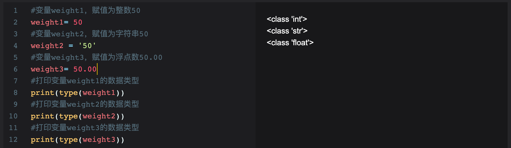

类型转换：int()，float()，str()

```python
weight1 = 50
weight2 = float(weight1)
weight3 = str(weight1)

print(type(weight1))
print(type(weight2))
print(type(weight3))

print(weight3)  # 50
```

# 四：流程控制

### 4.1 if流程控制

```python
if 条件:
    ...
else:
	...
    
    
if 条件1:
    ...
elif 条件2:
    ...
elif 条件3:
    ...
else:
    ...
```

### 4.2 循环

**for循环**

`for` 循环用于迭代序列（即列表、元组、字典、集合或字符串等）。这与其他编程语言中的 `for` 关键字不太相似，而是<font color='red'>**更像其他面向对象编程语言中的迭代器方法：for var in 集合**</font>

```python
numbers = [1, 2, 3, 4, 5, 6, 7, 8, 9, 10, 11, 12, 13, 14, 15, 16, 17, 18, 19, 20]

for var in numbers:
    print(var)
```

**while循环**

while循坏同其他语言while类似，while 条件:

```python
i = 0
while i < 20:
    i += 1
    print(i)
```

break与continue与其他语言相同：

- break：跳出整个循坏
- continue：跳过本轮

```python
# 对 20 以内的偶数求和
count = 0
i = 0
while i < 20:
    i += 1
    if i % 2 != 0:
        continue
    count += i

print("count = ", count)
```

# 五：列表List []

### 5.1 列表概念

列表是有序数据的集合，定义的语法是使用方括号[]扩起来以逗号分隔的数据，如：

```python
eight_immortal = ['汉钟离', '张果老', '韩湘子', '铁拐李', '吕洞宾', '何仙姑', '蓝采和', '曹国舅']
print(eight_immortal)
```

Python中，列表有如下特性：

- 有序：如果两个列表包含的元素相同，但是元素的排列顺序不同，那么他们是两个不同的列表。
- 同一个列表可以包含不同类型的数据
- 元素可重复
- 可以使用索引、切片访问

### 5.2 使用步长访问列表

步长使用方法：==列表名[m:n:步长]== 步长在实际的编程中，是用数据表示的，1 表示 1 步，2 表示 2 步，步长也可以省略，省略时步长默认为 1。

```python
eight_immortal = ['汉钟离', '张果老', '韩湘子', '铁拐李', '吕洞宾', '何仙姑', '蓝采和', '曹国舅']
print(eight_immortal[0:7:2])  # ['汉钟离', '韩湘子', '吕洞宾', '蓝采和']

# 步长为1，表示从前向后访问，步长为 -1，即表示反向访问，起点为曹国舅，反向访问1步，访问到蓝采和，继续反向访问1步，为何仙姑
```

==将步长设置为 -1，可以实现列表的翻转==：步长为1，表示从前向后访问，步长为 -1，即表示反向访问，起点为曹国舅，反向访问1步，访问到蓝采和，继续反向访问1步，为何仙姑

```python
eight_immortal = ['汉钟离', '张果老', '韩湘子', '铁拐李', '吕洞宾', '何仙姑', '蓝采和', '曹国舅']
print(eight_immortal[::-1])  # ['曹国舅', '蓝采和', '何仙姑', '吕洞宾', '铁拐李', '韩湘子', '张果老', '汉钟离']
```

### 5.3 列表嵌套

==列表可以嵌套==：列表中的元素同样可以是一个列表，嵌套的列表共占元素的一个位置，具体位置信息如下图

```python
my_list = ['a', ['bb', ['ccc', 'ddd'], 'ee', 'ff'], 'g', ['hh', 'ii'], 'j']
print(my_list) # my_list长度为5
```

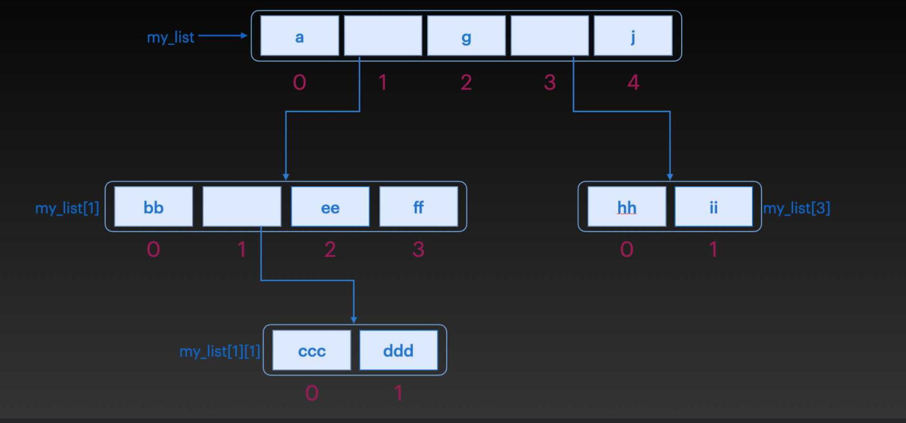

对于只嵌套一个的列表，访问其中某个元素时，索引的使用方法是`列表名[嵌套列表的位置][所需访问的元素在嵌套列表的位置]`，比如，我们想访问hh，方法就是`my_list[3][0]`，3 是嵌套列表在 `my_list` 中的位置，0 是 hh 在嵌套列表中的位置

```python
my_list = ['a', ['bb', ['ccc', 'ddd'], 'ee', 'ff'], 'g', ['hh', 'ii'], 'j']

# a
print(my_list[0])  

# ['bb', ['ccc', 'ddd'], 'ee', 'ff']
print(my_list[1])  

# bb
print(my_list[1][0])

# ccc
print(my_list[1][1][0])
```

### 5.4 修改列表元素

一次改变一个值（通过索引）：

```python
eight_immortal = ['汉钟离', '张果老', '韩湘子', '铁拐李', '吕洞宾', '何仙姑', '蓝采和', '曹国舅']

eight_immortal[0] = '逍遥闲散'
eight_immortal[5] = '清婉动人'
```

一次改变多个值（通过切片）：

```python
eight_immortal = ['汉钟离', '张果老', '韩湘子', '铁拐李', '吕洞宾', '何仙姑', '蓝采和', '曹国舅']

eight_immortal[0:3] = ['逍遥闲散', '倒骑毛驴','巧夺造化']

print(eight_immortal)
```

### 5.5 删除元素  del  remove  pop

删除元素：==del 列表名[index]==

```python
eight_immortal = ['汉钟离', '张果老', '韩湘子', '铁拐李', '吕洞宾', '何仙姑', '蓝采和', '曹国舅']

del eight_immortal[1]
print(eight_immortal)
```

删除多个元素：==del 列表名[start:end]==

```python
eight_immortal = ['汉钟离', '张果老', '韩湘子', '铁拐李', '吕洞宾', '何仙姑', '蓝采和', '曹国舅']

del eight_immortal[0:3]
print(eight_immortal)
```

删除指定元素值的元素：==列表名.remove(元素值)==，注意：如果指定的元素在列表中不存在，则会报错。

```python
eight_immortal = ['汉钟离', '张果老', '韩湘子', '铁拐李', '吕洞宾', '何仙姑', '蓝采和', '曹国舅']

eight_immortal.remove('汉钟离')
```

删除指定index的元素：==列表名.pop(index)==，如果不指定index，默认删除最后一个元素

```python
eight_immortal = ['汉钟离', '张果老']

eight_immortal.pop(1)  #等价于：eight_immortal.pop()
print(eight_immortal)  #['汉钟离']
```

**remove与pop的区别：**

- remove传入的参数为元素值，pop传入的参数为索引值

- remove返回值为None，pop的返回值为删除的元素

  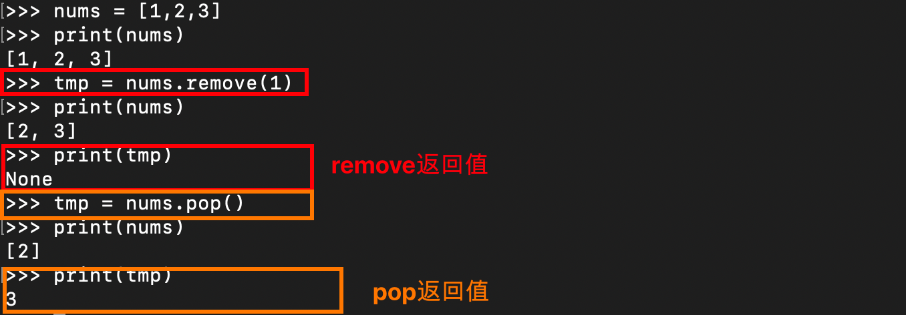

### 5.6 增加元素  +  append  insert

==列表名 += [元素1,元素2,元素3,...,元素n]==   使用`+`往列表中添加元素，添加的元素会自动的被添加到列表尾部

```python
eight_immortal = ['汉钟离', '张果老', '韩湘子', '铁拐李', '吕洞宾', '何仙姑', '蓝采和', '曹国舅']
print(eight_immortal)

eight_immortal += ['容成公', '李耳', '董仲舒','张道陵','严君平','李八百','范长生','尔朱先生']
print(eight_immortal)
```

==列表名.append(元素)==  `append()` 也可以为列表添加元素，和`+`一样，也是在列表的结尾处添加元素，可以添加一个元素或列表

```python
eight_immortal = ['汉钟离', '张果老', '韩湘子', '铁拐李']
print(eight_immortal)

eight_immortal.append('吕洞宾')
print(eight_immortal)  #['汉钟离', '张果老', '韩湘子', '铁拐李', '吕洞宾']

eight_immortal.append(['何仙姑', '蓝采和', '曹国舅'])
print(eight_immortal)  #['汉钟离', '张果老', '韩湘子', '铁拐李', '吕洞宾', ['何仙姑', '蓝采和', '曹国舅']]
```

`+`和`append()`都是在列表的结尾处添加元素，那如果是想在列表的开始处添加元素或者是在列表中的任意位置添加元素需要如何实现呢？答：insert

==列表名.insert(index, 元素值)==  将元素值插入index位置（相当于在原来index位置之前插入一个元素）

```python
eight_immortal = ['汉钟离', '张果老', '韩湘子', '铁拐李']

eight_immortal.insert(3, '吕洞宾')
print(eight_immortal)  # ['汉钟离', '张果老', '韩湘子', '吕洞宾', '铁拐李']
```

# 六：字典 {:}

字典：一系列键值对的集合

### 6.1 字典创建语法

创建字典时，只需要将键值对用花括号`{}` 括起来，每个键值对的键和值之间用冒号 `:` 分隔，每个键值对之间用逗号 `,` 分隔。

==d = {'姓名':'张三', '律师':'罗翔'}==

```python
ne_zha = {'英雄名字': '哪吒', '最大生命': 7268, '生命成长': 270.4, '初始生命': 3483, '最大法力': 1808}
print(ne_zha)
print(type(ne_zha))

------------

{'英雄名字': '哪吒', '最大生命': 7268, '生命成长': 270.4, '初始生命': 3483, '最大法力': 1808}
<class 'dict'>
```

也可以用==dict构造函数==来创建新字典：

```python
# 注意：1.关键字不是字符串字面量；2.使用了等号而不是冒号来赋值。
ne_zha = dict(英雄名字='哪吒', 最大生命=7268, 生命成长=270.4)

print(ne_zha)  #{'英雄名字': '哪吒', '最大生命': 7268, '生命成长': 270.4}
```


### 6.2 访问/遍历字典

访问某个key对应的value：

- ==字典名[key]==
- ==字典名.get(key)==
- 注意：在创建字典时，当键值重复时，以后加入的键值对为准

```python
ne_zha['英雄名字']
ne_zha.get('英雄名字')
```

遍历字典中所有键名/值名：

- ==for key in 字典:==

```python
ne_zha = {'英雄名字': '哪吒', '最大生命': 7268, '生命成长': 270.4, '初始生命': 3483, '最大法力': 1808}

for key in ne_zha:
    print(key)
    
for key in ne_zha:
    print(ne_zha[key])
```

也可以使用==字典名.values()==函数返回字典的值，

```python
ne_zha = {'英雄名字': '哪吒', '最大生命': 7268, '生命成长': 270.4, '初始生命': 3483, '最大法力': 1808}

for value in ne_zha.values():
    print(value)
```

使用==字典名.items()==访问字典键值对：

```python
ne_zha = {'英雄名字': '哪吒', '最大生命': 7268, '生命成长': 270.4, '初始生命': 3483, '最大法力': 1808}

for key,value in ne_zha.items():
    print("key = ", key, "value = ", value)
```

### 6.3 修改字典

#### 6.3.1 添加项目

==字典名[新key] = value==

```python
ne_zha = {'英雄名字': '哪吒', '最大生命': 7268, '生命成长': 270.4, '初始生命': 3483, '最大法力': 1808}

ne_zha['最大每5秒回血'] = 98
print(ne_zha)
```

#### 6.3.2 删除项目 pop popitem del clear

==字典名.pop(key)==  删除指定key的键值对

```python
ne_zha = {'英雄名字': '哪吒', '最大生命': 7268, '生命成长': 270.4, '初始生命': 3483, '最大法力': 1808}
ne_zha.pop('英雄名字')
```

==字典名.popitem()==  删除最后插入的项目（在 3.7 之前的版本中，删除随机项目）

```python
ne_zha = {'英雄名字': '哪吒', '最大生命': 7268, '生命成长': 270.4, '初始生命': 3483, '最大法力': 1808}
ne_zha.popitem()
```

==del 字典名[键名]==

```python
ne_zha = {'英雄名字': '哪吒', '最大生命': 7268, '生命成长': 270.4, '初始生命': 3483, '最大法力': 1808}
del ne_zha['英雄名字']
```

del也可以完全删除字典，==del 字典==，内容与定义同时删除

```python
ne_zha = {'name':'na_zha', 'age':18}
del ne_zha
print(ne_zha)  # 会报错，因为删除之后 ne_zha 不再存在。
```

清空字典：==字典名.clear()==，只删除内容

```python
ne_zha = {'name':'na_zha', 'age':18}
ne_zha.clear()
print(ne_zha)  # {}
```

### 6.4 复制字典

==浅复制：dirct2 = dirct1==，`dict2` 只是对 `dict1` 的引用，而 `dict1` 中的更改也将自动在 `dict2` 中进行

```python
ne_zha = {'name':'na_zha', 'age':18}

ne_zha_copy = ne_zha
```

==深复制：dirct2 = dirct1.cpoy()==

```python
ne_zha = {'name':'na_zha', 'age':18}
ne_zha_copy = ne_zha.copy
print(ne_zha_copy)
```

==拷贝构造：dirct2 = dict(dirct1)==

```python
ne_zha = {'name':'na_zha', 'age':18}
ne_zha_copy = dict(ne_zha)
print(ne_zha_copy)
```

# 七：元组 ()

元组和列表很像，区别在于元组创建完成后便不能被修改。创建元组很简单，只需要将用逗号分隔的元素放到 `()` 中，`(元素1,元素2,元素3,...,元素n)`，如果元素为字符串，需要添加引号

### 8.0 元组与列表区别

元组与列表相同，也是容器对象，可以存储不同类型的内容。

元组与列表有两个不同点：

- **<font color = 'red'>元组的声明使用小括号，而列表使用方括号，当声明只有一个元素的元组时，需要在这个元素的后面添加英文逗号；</font>**
- **<font color = 'red'>元组声明和赋值后，不能像列表一样添加、删除和修改元素，也就是说元组在程序运行过程中不能被修改。</font>**

用于列表的排序、替换、添加等方法也不适用于元组，适用于元组的主要运算有元组的合并、遍历、求元组的最大值和最小值等操作方法。

### 7.1 创建元组

==元组名 = (元素1, 元素2, ..., 元素n)==

```python
loong_son = ('囚牛', '睚眦', '嘲风', '蒲牢', '狻猊', '霸下', '狴犴', '负屃', '螭吻')
```

注意：<font color = 'blue'>**如果需要创建一个仅包含一个元素的元组，必须在该元素后面添加一个逗号**</font>，否则，Python 无法将变量识别为元组。如下:

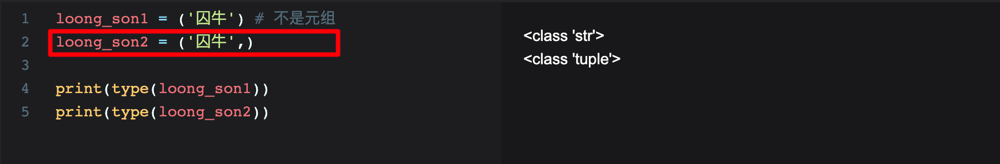

### 7.2 访问元组

==正索引访问==

```python
loong_son = ('囚牛', '睚眦', '嘲风', '蒲牢', '狻猊', '霸下', '狴犴', '负屃', '螭吻')
print(loong_son[0])  #囚牛
```

==负索引访问==

```python
loong_son = ('囚牛', '睚眦', '嘲风', '蒲牢', '狻猊', '霸下', '狴犴', '负屃', '螭吻')
print(loong_son[-1])  #螭吻
```

==切片访问==

```python
loong_son = ('囚牛', '睚眦', '嘲风', '蒲牢', '狻猊', '霸下', '狴犴', '负屃', '螭吻')

print(loong_son[1:])  # 访问下标1到最后（包括最后一个）
print(loong_son[:3])  # 访问从开始到3下标（不包括下标为3的）
print(loong_son[:])   # 访问所有
print(loong_son[-3:-1])  # 访问倒数第三个到倒数第一个（不包括倒数第一个）
print(loong_son[-3:])    # 访问倒数第三个到最后（包括最后一个）
print(loong_son[:-1])    # 访问从开始到倒数第一个（不包括倒数第一个）
```

==遍历元组==

```python
loong_son = ('囚牛', '睚眦', '嘲风', '蒲牢', '狻猊', '霸下', '狴犴', '负屃', '螭吻')

for elem in loong_son:
    print(elem)
```

### 7.3 无法修改的特性

元组在创建完成后便不能被修改！因此任何关于修改元组的操作都会报错，比如添加新元素到元组中，或者是删除元组中的某些元素

元组是不可改变的，因此无法从中删除元素，但可以删除整个元组。

```python
loong_son = ('囚牛', '睚眦', '嘲风', '蒲牢', '狻猊', '霸下', '狴犴', '负屃', '螭吻')
del loong_son  # 删除整个元组
```

元组的不可修改特性可能会让元组变得非常不灵活，因为元组作为容器对象，很多时候需要对容器的元素进行修改，这在元组中是不允许的。

元组可以说是列表数据的一种补充，数据的不可修改性在程序设计中也是非常重要的。例如，当需要将数据作为参数传递给API，但不希望API修改参数时，就可以传递一个元组类型；再如，当需要定义一组Key时，也可以采用元组类型。因此可以说元组和列表是互为补充的数据类型。

### 7.4 合并元组

元组不能被修改，但是两个元组是可以合并成一个新的元组的，在 Python 中，使用==+运算符可以连接两个或多个元组==，语句如下：

```python
loong_son1 = ('囚牛', '睚眦', '嘲风', '蒲牢', '狻猊')
loong_son2 = ('霸下', '狴犴', '负屃', '螭吻')

loong_son = loong_son1 + loong_son2
print(loong_son)
```

# 八：集合 {}

集合是==无序==元素的集合，集合中的元素==不可重复==，并且创建完成后，其中的元素不可更改。但是整个集合是可以更改的，我们可以向其增加元素，也可以从中删除元素。也就是说，<font color='blue'>**我们无法修改集合中的元素，但是我们可以对整个集合进行添加或者是删除等更改的操作**</font>。

### 8.0 列表、元组、集合区别

- 列表：[]扩起来，有序可重复，可用下标访问，可以增删改

- 元组：()扩起来，有序可重复，可用下标访问，不可增删改，

- 集合：{}扩起来，无序不可重复，不可用下标访问，可增删，不可修改单个元素值

### 8.1 集合创建

{元素1, 元素2, 元素3, ..., 元素n}

```python
Set = {'飞狐外传', '神雕侠侣'} #集合
```

注意：集合中的元素不可重复，如果有重复元素，重复的元素将被忽略。（<font color='red'>**列表和元组可以重复**</font>）

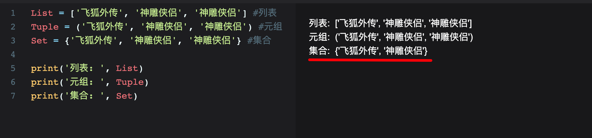

### 8.2 访问集合元素 for、in

集合中的元素是无序的，无法用索引进行访问，可以==通过 `for` 循环来遍历集合==的元素，另外，还可以==使用 `in` 关键字来判断集合中是否存在某个元素==

**for循环**

```python
novels = {'飞狐外传', '雪山飞狐', '连城诀', '天龙八部'}

for novel in novels:
    print(novel)
```

**in关键字**

```python
novels = {'飞狐外传', '雪山飞狐', '连城诀', '天龙八部'}

print('飞狐外传' in novels)  #True
print('封神榜' in novels)  #False
```

### 8.3 集合修改

#### 8.3.1 添加元素 add update

添加一个元素：==集合名.add(元素名)==

添加多个元素：==集合名.update({元素1,元素2,...,元素n})==

```python
nums = {'one', 'two'}

nums.add('three')
print(nums)  #{'three', 'one', 'two'}

nums.update({'four', 'five', 'six'})
print(nums)  #{'five', 'three', 'one', 'two', 'four', 'six'}
```

#### 8.3.2 删除元素 discard remove

- ==集合名.discard(元素)==，从集合中删除一个不存在的元素时，`discard()` 不会执行任何操作

- ==集合名.remove(元素)==，从集合中删除一个不存在的元素时， `remove()` 会抛出一个异常。
- 这两个函数的区别在于，从集合中删除一个不存在的元素时，`discard()` 不会执行任何操作，而 `remove()` 会抛出一个异常。

```python
novels = {'飞狐外传', '雪山飞狐', '连城诀', '天龙八部'}

novels.discard('飞狐外传')

novels.remove('雪山飞狐')
```

当删除不存在的元素时：

```python
novels = {'飞狐外传', '雪山飞狐', '连城诀', '天龙八部'}

novels.discard('越女剑')  # 不会执行任何操作

novels.remobe('越女剑')  #会抛出一个异常: KeyError: '越女剑'
```

### 8.4 集合操作  并|  交&  差-  对称差集^

并：==集合1.union(集合2)、|==

```python
nums1 = {'one', 'two'}
nums2 = {'three', 'four'}

print(nums1.union(nums2))  #{'three', 'one', 'two', 'four'}
print(nums1 | nums2)  #{'three', 'one', 'two', 'four'}
```

交：==集合1.intersection(集合2)、&==

```python
nums1 = {'one', 'two', 'zero'}
nums2 = {'zero', 'three', 'four'}

print(nums1.intersection(nums2))  #{'zero'}
print(nums1 & nums2)  #{'zero'}
```

差：==集合1.difference(集合2)、-==

```python
nums1 = {'one', 'two', 'zero'}
nums2 = {'zero', 'three', 'four'}

print(nums1.intersection(nums2))  #{'two', 'one'}  #属于集合1不属于集合2的元素
print(nums1 & nums2)  #{'two', 'one'}
```

**对称差集：属于集合 A，不属于集合 B 的以及属于集合 B 不属于集合 A 的元素集合，就是**<font color='blue'>**集合 A 与集合 B 的并集减去集合 A 与集合 B 的交集**</font>

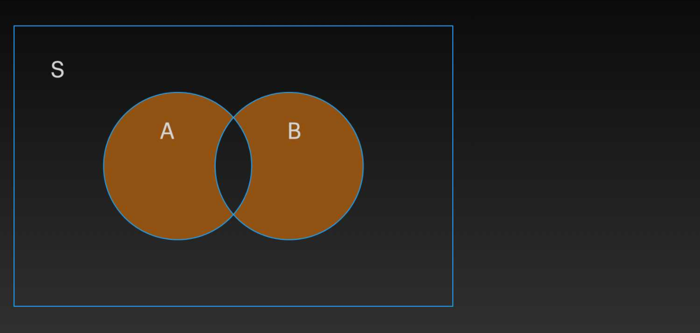

对称差集：==集合1.symmetric_difference(集合2)、^==

```python
nums1 = {'one', 'two', 'zero'}
nums2 = {'zero', 'three', 'four'}

print(nums1.symmetric_difference(nums2))  #{'two', 'one', 'three', 'four'}
print(nums1 ^ nums2)  #{'two', 'one', 'three', 'four'}
```

# 九：函数

> 为什么需要函数：抽象，代码复用，模块化

<font color = 'green'>**函数定义**</font>：==def 函数名(参数):==

<font color='red'>**（Python是弱数据类型的语言，在函数定义的时候不需要声明返回值类型）**</font>

```python
def greet():
    print("大禹治水")

greet()
```

<font color = 'green'>**参数位置可以不固定**</font>：python函数在参数传递的时候，除了常规的参数传递外，还可以==在传递值的时候，带上参数的名字==，具体形式为 `keyword = value`，这里的 `keyword` 必须匹配上一个函数定义中的参数名，也就是说是 `参数名1=值1`，`参数名2=值2`，`参数名3=值3` 这种形式。 ==指定名字后，调用函数的时候参数位置可以不固定==

虽然顺序可以不用保持一致，但是值的个数还需要和参数的个数保持相同。不同的话会报错。

```python
def cal(qty, item,price):
    print(f'{qty} {item} cost ${price:.2f}')

cal(2, 'apples', 8.18)  #2 apples cost $8.18
cal(qty=6, item='bananas', price=5.74)  #6 bananas cost $5.74
cal(item='bananas', price=5.74, qty=6)  #6 bananas cost $5.74
```

<font color = 'green'>**默认参数**</font>：指定默认值之后，在调用函数时如果没有指定某个参数的值，就用参数的默认值

```python
def cal(qty=6, item='bananas', price=5.74):
    print(f'{qty} {item} cost ${price:.2f}')

cal()  #6 bananas cost $5.74
cal(3) #3 bananas cost $5.74
cal(price=10.0)  #6 bananas cost $10.00
```

<font color='green'>**return语句**</font>： 立即结束本函数的执行，将程序的执行控制权交还给调用者/ 返回数据给调用者。

```python
# 求任意数字的绝对值函数
def absolute_value(num):
    if num >= 0:
        return num
    else:
        return -num


print(absolute_value(2))
print(absolute_value(-4))
```

没有写return语句的话，默认返回None

```python
def test():
    print('没有返回值')

a = test()
print(a)
```

<font color='green'>**模拟main函数**</font>：python是脚本语言，按命令一条一条执行，并没有像编译性语言有main函数作为程序入口。但是可以自定义一个main函数，使用`if __name__ == "__main__"`来模拟程序的入口：当前`__name__`变量的值为`__main__`时，即当前模块是主模块（也就是调用其他模块的模块），那么此模块名字就是`__main__`，就会调用定义的main函数

```python
def main():
    li = [10, 3, 2, 7, 20, -10]
    print("快速排序前：", li)
    quick_sort(li, 0, len(li)-1)
    print("快速排序后：", li)


if __name__ == "__main__":
    main()
```


**匿名函数**

python使用lambda来创建匿名函数，所谓匿名，意即不再使用 def 语句这样标准的形式定义一个函数

- lambda的主体是一个表达式，而不是一个代码块。仅仅能在lambda表达式中封装有限的逻辑进去
- lambda 函数拥有自己的命名空间，且不能访问自己参数列表之外或全局命名空间里的参数

```python
lambda [arg1 [,arg2,.....argn]]:expression
```

```python
sum = lambda arg1, arg2: arg1 + arg2

# 调用sum函数
print ("相加后的值为 : ", sum( 10, 20 ))
```


# 十：类和对象

### 10.0 关于下划线的说明

- **\_\_foo__**：定义的是特殊方法，一般是系统定义名字 ，类似 **\_\_init__()** 之类的。
- **_foo**:：以单下划线开头的表示的是 protected 类型的变量，即保护类型只能允许其本身与子类进行访问，不能用于 **from module import \***
- **__foo**：双下划线的表示的是私有类型(private)的变量, 只能是允许这个类本身进行访问了。

### 10.1 类的创建

==class 类名:==

```python
class Bird:
    # 对象初始化方法
    def __init__(self, n, c, s):
        self.name = n
        self.color = c
        self.size = s
    
    # 类方法
    def get_description(self):
        description = f'{self.name} {self.color} {self.size}'
        print(description)
```

 **==\__init__()方法==**

```python
class Bird:
    def __init__(self, n, c, s):
    #对象初始化语句
        self.name = n   #添加一个name属性
        self.color = c
        self.size = s
```

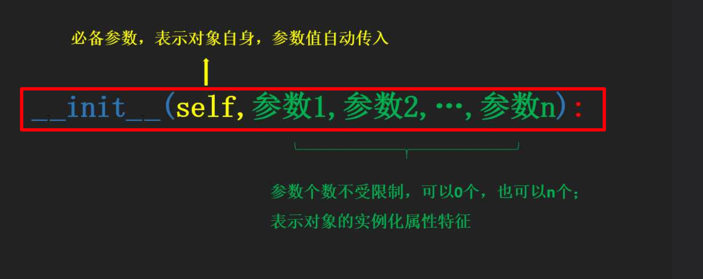

类中的函数称作方法，类的方法与普通的函数只有一个特别的区别：它们必须有一个额外的**第一个参数名称**, 按照惯例它的名称是 self。

`__init__()` 是一个特殊的方法，==每当我们实例化一个对象时，这个方法都会自动执行。方法名的开头为两个下划线，结尾同样为两个下划线==，这种命名的习惯主要是为了区分 Python 默认的方法名和我们自己定义的方法名。

`def __init__(self, n, c, s):` 语句中，参数 self 表示对象自身，代表实例化对象的引用。参数n, c, s则表示对象的属性，在我们创建的类 `Bird` 中就是表示，每一种鸟的具象化特征，比如鹦鹉、绿色、中等大小，==因此 __init__() 方法的作用是为对象的属性赋值==

**<font color='blue'>参数 self 是必须的，并且要位于其他参数的前面</font>**。在方法的定义中，之所以要必须包含 self 参数，是因为当实例化对象时，会自动调用 `__init__()` 方法，并且自动传入参数 self。<font color='red'>**每个方法都可以包含一个会自动传入的参数 self，这个参数是实例化对象的引用。这样方法便可以访问对象的属性和方法**</font>。在实例化对象时，由于 self 参数自动传入的，所以只需要传入其他参数的值。

添加类属性

### 10.2 对象

类是抽象的，对象是对类进行具象的实例化

```python
#创建类Bird
class Bird:

    #对象初始化语句
    def __init__(self, n, c, s):
        self.name = n
        self.color = c
        self.size = s

     #定义方法get_description，参数为self，自动传入
    def get_description(self):
        description = f'{self.name} {self.color} {self.size} '
        print(description)

#实例化对象my_bird，为my_bird赋予属性'鹦鹉', '绿色', '中等大小'
my_bird = Bird('鹦鹉', '绿色', '中等大小')
```

通过==对象名.属性名/方法名==的方式来访问属性与方法：

```python
my_bird = Bird('鹦鹉', '绿色', '中等大小')
print(my_bird.size)
my_bird.get_description()
```

==为属性设置默认值：在\__init__方法中为属性赋值即可==

```python
class Bird:
    def __init__(self, n, c, s):
        self.name = n
        self.color = c
        self.size = s
         #设置属性age的默认值为1
        self.age = 1
```

### 10.3 继承

==class 子类名(父类名)==

在实例化子类的对象时，首先要为父类中的属性赋值，对父类属性的赋值可以使用父类的 `__init__()` 方法。==super()函数是用于调用父类的一个方法==

```python
class Bird:
    '类文档字符串'
    def __init__(self, n, c, s):
        self.name = n
        self.color = c
        self.size = s
        self.age = 1

class Penguin(Bird):  #继承Bird类
    def __init__(self, n, c, s):
        super().__init__(n, c, s)  #使用父类的__init__方法为父类中的属性赋值
```

### 10.4 方法重写

如果从父类继承的方法不能满足子类的需求，可以对其进行改写，这个过程叫方法的覆盖（override），也称为方法的重写。

```python
class Parent:        # 定义父类
   def myMethod(self):
      print '调用父类方法'
 
class Child(Parent): # 定义子类
   def myMethod(self):
      print '调用子类方法'
 
c = Child()          # 子类实例
c.myMethod()         # 子类调用重写方法
```

### 10.5 对象销毁/垃圾回收

Python 使用了==引用计数==这一简单技术来跟踪和回收垃圾。在 Python 内部记录着所有使用中的对象各有多少引用。

一个内部跟踪变量，称为一个引用计数器。

当对象被创建时， 就创建了一个引用计数， 当这个对象不再需要时， 也就是说， 这个对象的引用计数变为0 时， 它被垃圾回收。但是回收不是"立即"的， 由解释器在适当的时机，将垃圾对象占用的内存空间回收。

```python
a = 40      # 创建对象  <40>
b = a       # 增加引用， <40> 的计数
c = [b]     # 增加引用.  <40> 的计数

del a       # 减少引用 <40> 的计数
b = 100     # 减少引用 <40> 的计数
c[0] = -1   # 减少引用 <40> 的计数
```

### 10.6 私有、保护、公有

==私有属性/方法：两个下划线开头==，声明该属性为私有，不能在类的外部被使用或直接访问。在类内部的方法中使用时通过self调用

```python
class JustCounter:
    __secretCount = 0  # 私有变量
    publicCount = 0    # 公开变量
 
    def count(self):
        self.__secretCount += 1
        self.publicCount += 1
        print self.__secretCount
 
counter = JustCounter()
counter.count()
print counter.publicCount
print counter.__secretCount  # 报错，实例不能访问私有变量
```

Python不允许实例化的类访问私有数据，但你可以使用 **object._className__attrName**（ **对象名._类名__私有属性名** ）访问属性，参考以下实例：

```python
class Runoob:
    __site = "www.runoob.com"

runoob = Runoob()
print(runoob._Runoob__site)  #可以打印成功
```

==保护属性/方法：一个下划线开头==，声明该属性为保护，即保护类型只能允许其本身与子类进行访问，不能用于 **from module import \***

==公有属性/方法：不加下划线开头==

### 10.7 Python内置的类的属性

- \__dict__ : 类的属性（包含一个字典，由类的数据属性组成）
- \__doc__ :类的文档字符串
- \_\_name__: 类名
- \__module\_\_: 类定义所在的模块（类的全名是'__main__.className'，如果类位于一个导入模块mymod中，那么className.__module__ 等于 mymod）
- \__bases__ : 类的所有父类构成元素（包含了一个由所有父类组成的元组）

```python
#!/usr/bin/python3
# -*- coding: UTF-8 -*-

class Employee:
    '所有员工的基类'
    empCount = 0

    def __init__(self, name, salary):
        self.name = name
        self.salary = salary
        Employee.empCount += 1

    def displayCount(self):
        print("总共员工数量为：", empCount)

print("类的属性：", Employee.__dict__, '\n')
print("类的文档字符串：", Employee.__doc__, '\n')
print("类名：", Employee.__name__, '\n')
print("类定义所在的模块：", Employee.__module__, '\n')
print("类的所有父类构成元素：", Employee.__bases__, '\n')
```

运行结果如下：

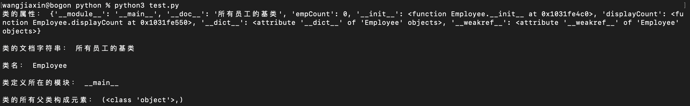

### 10.8 析构函数

\__del\_\_在对象销毁的时候被调用

```python
class Point:
   def __init__( self, x=0, y=0):
      self.x = x
      self.y = y
   def __del__(self):
      class_name = self.__class__.__name__
      print(class_name, "销毁")
```

### 10.9 运算符重载

Python同样支持运算符重载，实例如下：

```python
def __运算符__(self, other):
    语句块	
```

```python
class Vector:
   def __init__(self, a, b):
      self.a = a
      self.b = b
 
   def __str__(self):
      return 'Vector (%d, %d)' % (self.a, self.b)
   
   def __add__(self,other):
      return Vector(self.a + other.a, self.b + other.b)
 
v1 = Vector(2,10)
v2 = Vector(5,-2)
print(v1+v2)  #输出Vector(7, 8)
```

# 十一：模块和包

**<font color='blue'>包相当于一个文件夹，模块则相当于文件夹中的文件</font>**

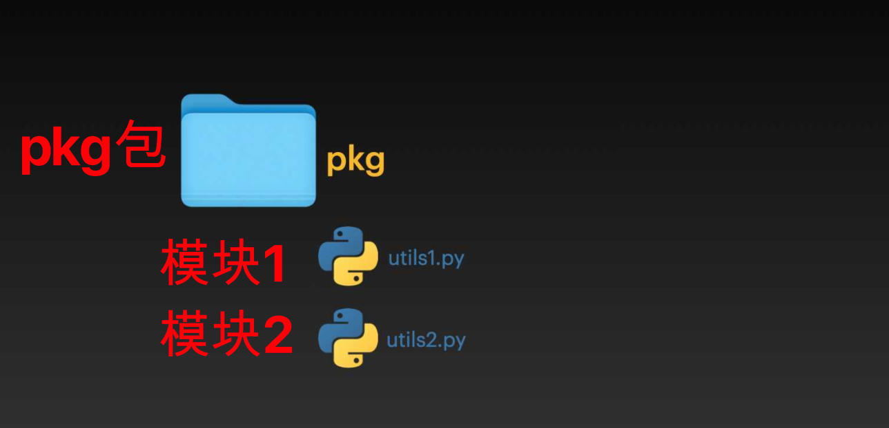

模块化好处：

- 简化问题求解
- 提高代码可维护性
- 提高代码可重用性
- 减少代码冲突：模块提供了一个独立的命名空间，独立命名空间的好处是可以避免函数名和变量名冲突。相同名字的函数和变量可以放在不同的模块中。因此，我们自己在编写模块时，不必考虑名字会与其他模块冲突。但是也要注意，尽量不要与内置函数名字冲突。

### 11.1 模块的创建

==一个 .py 文件便是一个模块（Module）==

### 11.2 模块的导入

==import 模块名==：Python 首先会从自己内置模块中查找是否含有该模块的定义，若未查询到会从 `sys.path` 对应的模块路径查询是否含有对应模块的定义，如果搜索完成，仍然没有对应的模块时，则抛出 import 的异常。即会从以下路径中搜索模块：

1. 在当前目录下搜索该模块
2. 在环境变量PYTHONPATH指定的路径列表中依次搜索
3. 在Python安装路径的lib库中搜索

可以通过sys.path查看这些路径：

```python
import sys
print(sys.path)
```

==import 模块名 as 新名字==：为导入的模块起一个新名字，这样便可以通过模块的别名来使用模块

==from 模块名 import 方法名==：<font color='red'>**from 语句让你从模块中导入一个指定的部分到当前命名空间中**</font>。使用这种方法导入时，调用方法不需要添加模块名前缀

有时候，为了方便，会使用 `from module_name import *` 来导入模块中的所有对象

```python
from sys import path

print(path)
```

```python
from utils import max_num, min_num

print(max_num(4, 5))
print(min_num(4, 5))
```

导入多个方法/类/对象时，用逗号分隔即可：<font color='blue'>**from 模块名 import 类1, 类2**</font>

==from 模块名 import 方法名 as 新名字==：	导入之后可以通过别名来使用对象

```python
from utils import max_num as max_n, min_num as min_n
print(max_n(4, 5))
print(min_n(4, 5))
```

注意：Python中不管你执行了多少次import，一个模块只会被导入一次，这样可以防止导入模块被一遍又一遍地执行。

**<font color='red'>注意：在模块引入方式上，推荐以import XXX的形式引入，以XXX.func()形式调用，不要from.xxx import *, 因为需要一个链条指向它，否则不方便代码查看与维护</font>**

### 11.3 包

包：如果将模块都放在同一个目录下，将变得越来越难管理。特别当模块具有相似的名称或相似的功能。这时候我们非常希望对这些模块进行分组管理，==Python 中的包实现了对模块分组管理的功能==

==包的创建非常简单，它利用了操作系统的分层文件结构。只要将模块放在一个目录下便可==


**导入包中的模块：**==import 包.模块名==、==from 包名 import 模块名==

```python
import pkg.utils1
import pkg.utils2

print(pkg.utils1.max_num(4, 5))
print(pkg.utils2.sum_num(4, 5))
```

导入包中的模块中的对象：from 包名.模块名 import 对象名

```python
from pkg.utils1 import max_num

print(max_num(4, 5))
```

# 十二：异常处理

### 12.1 异常是什么

异常是在程序运行过程中发生的错误，当异常发生时，需要对异常进行处理，否则整个程序将崩溃。

==Python中异常其实是一个对象，用来表示一个错误，当Python脚本发生异常时我们需要捕获处理它，否则程序会终止执行==

异常示例如下：

```python
print(1/0)
print("Done")
```

输出如下：

```shell
Traceback (most recent call last):
  File "script.py", line 1, in <module>
    print(1 / 0)
ZeroDivisionError: division by zero
```

例子中的 `1 / 0` 触发了 `ZeroDivisionError` 异常，由于没有对异常进行处理，导致了程序的崩溃，后面的语句没有再继续执行

### 12.2 异常处理

当Python脚本发生异常时我们需要捕获处理它，否则程序会终止执行。`try` 后面跟的是需要捕获异常的代码，`except` 后面跟的是捕获到异常后需要做的处理。每一个 `try` 语句块后面必须跟上一个 `except` 语句块，即使 `except` 语句块什么也不做。

==异常处理语法如下：==

```python
try:
    需要捕获异常的代码（即可能发生异常的代码）
except 异常名字：
    异常发生时执行的代码
else:
    没有发生异常执行的代码
finally:
    不论是否发生异常都会执行的代码
```

try的工作原理是：<font color='red'>**当开始一个try语句后，python就在当前程序的上下文中作标记**</font>，这样当异常出现时就可以回到这里，try子句先执行，接下来会发生什么依赖于执行时是否出现异常

- 如果当try后的语句执行时发生异常，python就跳回到try并执行第一个匹配该异常的except子句，异常处理完毕，控制流就通过整个try语句（除非在处理异常时又引发新的异常）
- 如果在try后的语句里发生了异常，却没有匹配的except子句，异常将被递交到上层的try，或者到程序的最上层（这样将结束程序，并打印默认的出错信息）
- 如果在try子句执行时没有发生异常，python将执行else语句后的语句（如果有else的话），然后控制流通过整个try语句

实例：

```python
try:
    print(1 / 0)
except ZeroDivisionError:
    print("ZeroDivisionError happened!")

print("Done!")
```

输出如下：（异常被处理掉了，程序继续执行Done）

```python
ZeroDivisionError happened!
Done!
```

实例：打开一个文件并写入内容

```python
try:
    fh = open("testfile", "w")
    fh.write("这是一个测试文件，用于测试异常!!")
except IOError:
    print "Error: 没有找到文件或读取文件失败"
else:
    print "内容写入文件成功"
    fh.close()
```

**捕获多个异常：**

```python
try:
    print(1 / 0)
    #除0异常
    with open('test.log') as file:
    #文件不存在异常
        read_data = file.read()
except ZeroDivisionError:
    print("ZeroDivisionError happened!")
except FileNotFoundError:
    print("FileNotFoundError happened!")

print("Done!")
```

输出如下：

```python
ZeroDivisionError happened!
Done!
```

在执行代码 `print(1 / 0)` 时，==发生了除 0 异常，所以没有执行后面的打开文件的代码==，后面的异常处理代码输出了 `ZeroDivisionError happened!`。

### 12.3 抛出异常

12.2是异常出现时，可以做的处理。另外，我们也可以主动抛出异常。主动抛出异常使用 ==raise== 关键字

raise有如下三种用法：

- raise：单独一个 raise。该语句引发当前上下文中捕获的异常（比如在 except 块中），或默认引发 RuntimeError 异常。

- raise 异常类名称：raise 后带一个异常类名称，表示引发执行类型的异常。

- raise 异常类名称(描述信息)：在引发指定类型的异常的同时，附带异常的描述信息。

```python
x = 10
if x > 5:
    raise Exception('x should not exceed 5. The  value of x was: {}'.format(x))
```


# 十三：练习题：快排

C++实现：

```cpp
#include <iostream>
#include <vector>
#include <algorithm>
using namespace std;

// 一次划分
int onePartition(vector<int> & vec, int left, int right) {
    int base = vec[left];

    while(left < right) {
        // 从后往前找比基准小的，放在前面
        while(left < right && vec[right] >= base) {
            right--;
        }
        if(left < right && vec[right] < base) {
            vec[left] = vec[right];
        }

        //前往后找比基准大的，放在后面
        while(left < right && vec[left] <= base) {
            left++;
        }
        if(left < right && vec[left] > base) {
            vec[right] = vec[left];
        }
    }
    vec[left] = base;
    return left;
}

// 递归排序
void quickSort(vector<int> & vec, int left, int right) {
    int pos = onePartition(vec, left, right);

    if(pos - left > 1) {
        quickSort(vec, left, pos-1);
    }
    if(right - pos > 1) {
        quickSort(vec, pos+1, right);
    }
}

// 快排的外壳
void quickSort(vector<int> & vec) {
    if(vec.empty()) {
        return;
    }
    quickSort(vec, 0, vec.size()-1);
}

int main() {
    vector<int> arr = {10, 3, 2, 7, 20, -10};

    cout<<"快速排序前：";
    for(auto & val : arr) {
        cout<<val<<" ";
    }
    cout<<endl;

    quickSort(arr);

    cout<<"快速排序后：";
    for(auto & val : arr) {
        cout<<val<<" ";
    }
    cout<<endl;
}
```

python实现：

```python
def one_partition(li, left, right):
    base = li[left]

    while left < right:
        # 从后往前找比基准小的，放在前面
        while left < right and li[right] >= base:
            right -= 1
        if left < right and li[right] < base:
            li[left] = li[right]
        # 从前往后找比基准大的，放在后面
        while left < right and li[left] <= base:
            left += 1
        if left < right and li[left] > base:
            li[right] = li[left]

    li[left] = base
    return left


def quick_sort(li, left, right):
    pos = one_partition(li, left, right)
    if pos - left > 1:
        quick_sort(li, left, pos-1)
    if right - pos > 1:
        quick_sort(li, pos+1, right)


def main():
    li = [10, 3, 2, 7, 20, -10]
    print("快速排序前：", li)
    quick_sort(li, 0, len(li)-1)
    print("快速排序后：", li)


if __name__ == "__main__":
    main()
```


# 附录：Python2.x与Python3.x区别

- print函数：print 语句没有了，取而代之的是 **print()** 函数
- Python 2 有 ASCII str() 类型，unicode() 是单独的，不是 byte 类型。现在， 在 Python 3，我们最终有了 Unicode (utf-8) 字符串，以及一个字节类：byte 和 bytearrays。由于 Python3.x 源码文件默认使用 utf-8 编码，所以使用中文就更加方便了

- 在 Python 2.x 中 **/** 除法就跟我们熟悉的大多数语言，比如 Java 和 C ，整数相除的结果是一个整数，把小数部分完全忽略掉，浮点数除法会保留小数点的部分得到一个浮点数的结果。

  在 Python 3.x 中 **/** 除法不再这么做了，对于整数之间的相除，结果也会是浮点数。

- 捕获异常：捕获异常的语法由 **except exc, var** 改为 **except exc as var**

# 附录：with ... as语句

> 参考：[Python with as 用法](https://www.cnblogs.com/zhangbao003/p/8926366.html)

<font color='red'>**有一些任务，可能事先需要设置，事后做清理工作**</font>。对于这种场景，Python的with语句提供了一种非常方便的处理方式。一个很好的例子是文件处理，你需要获取一个文件句柄，从文件中读取数据，然后关闭文件句柄。

如果不用with语句，代码如下：

```python
file = open("/tmp/foo.txt")
data = file.read()
file.close()
```

这里有两个问题。一是可能忘记关闭文件句柄；二是文件读取数据发生异常，没有进行任何处理。下面是处理异常的加强版本：

```python
file = open("/tmp/foo.txt")
try:
    data = file.read()
finally:
    file.close()
```

虽然这段代码运行良好，但是太冗长了。这时候就是with一展身手的时候了。除了有更优雅的语法，with还可以很好的处理上下文环境产生的异常。下面是with版本的代码：

```python
with open("/tmp/foo.txt") as file:
    data = file.read()
```

**with语句工作流程：**

- with所求值的对象必须有一个\__enter\_\_()方法，一个\_\_exit__()方法
- 紧跟with后面的语句被求值后，返回对象的\__enter\_\_()方法被调用，这个方法的返回值将被赋值给as后面的变量。当with后面的代码块全部被执行完之后，将调用前面返回对象的\_\_exit__()方法。（==有点类似于局部变量出作用域自动调用析构函数==）

如下代码可以说明with的工作流程：

```python
class Sample:
    def __enter__(self):
        print("In __enter__()")
        return "Foo"
 
    def __exit__(self, type, value, trace):
        print("In __exit__()")
 
def get_sample():
    return Sample()
 
with get_sample() as sample:
    print("sample:", sample)
```

输出如下：

```python
In __enter__()
sample: Foo
In __exit__()
```

```
1. __enter__()方法被执行
2. __enter__()方法返回的值 - 这个例子中是"Foo"，赋值给变量'sample'
3. 执行代码块，打印变量"sample"的值为 "Foo"
4. __exit__()方法被调用
```

==with真正强大之处是它可以处理异常的==：with后面的代码块抛出任何异常时，\__exit\_\_()方法会被执行。

因此，Python的with语句是提供一个有效的机制，让代码更简练，同时在异常产生时，清理工作更简单。


